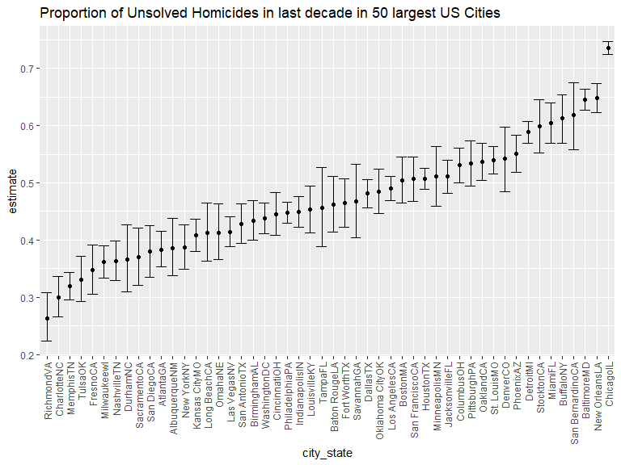
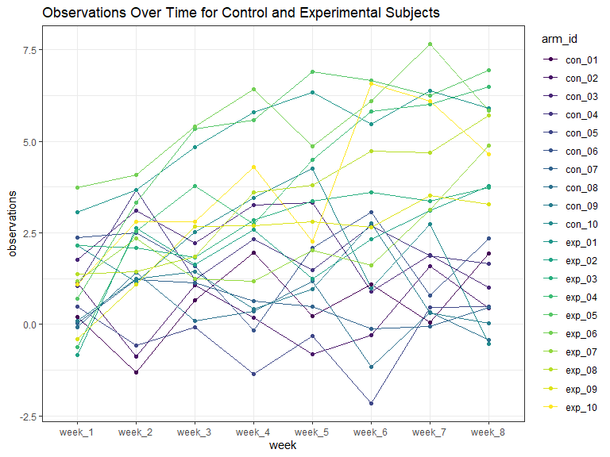

P8105\_HW5\_xc2610
================
Xuanhe Chen

## Problem 1

``` r
homicide_df = 
  read_csv("./data/homicide-data.csv", na = c("", "Unknown")) %>%
  mutate(
    city_state = str_c(city, state),
    resolution = case_when(
      disposition == "Closed without arrest" ~ "unsolved",
      disposition == "Open/No arrest" ~ "unsolved",
      disposition == "Closed by arrest" ~ "solved",
    )) %>%
  relocate(city_state) %>%
  filter(city_state != "TulsaAL")
```

    ## Rows: 52179 Columns: 12

    ## -- Column specification --------------------------------------------------------
    ## Delimiter: ","
    ## chr (8): uid, victim_last, victim_first, victim_race, victim_sex, city, stat...
    ## dbl (4): reported_date, victim_age, lat, lon

    ## 
    ## i Use `spec()` to retrieve the full column specification for this data.
    ## i Specify the column types or set `show_col_types = FALSE` to quiet this message.

``` r
baltimore_df =
  homicide_df %>%
  filter(city_state == "BaltimoreMD")

baltimore_summary =
  baltimore_df %>%
  summarize(
    unsolved = sum(resolution == "unsolved"),
    n = n()
  )

baltimore_test =
  prop.test(
    x = baltimore_summary %>% pull(unsolved), 
    n = baltimore_summary %>% pull(n))

baltimore_test %>%
  broom::tidy()
```

    ## # A tibble: 1 x 8
    ##   estimate statistic  p.value parameter conf.low conf.high method    alternative
    ##      <dbl>     <dbl>    <dbl>     <int>    <dbl>     <dbl> <chr>     <chr>      
    ## 1    0.646      239. 6.46e-54         1    0.628     0.663 1-sample~ two.sided

``` r
prop_test_function = function(city_df) {
  
  city_summary =
  city_df %>%
  summarize(
    unsolved = sum(resolution == "unsolved"),
    n = n()
  )

  city_test =
    prop.test(
      x = city_summary %>% pull(unsolved), 
      n = city_summary %>% pull(n))
  
  return(city_test)
}
```

``` r
prop_test_function(baltimore_df)
```

    ## 
    ##  1-sample proportions test with continuity correction
    ## 
    ## data:  city_summary %>% pull(unsolved) out of city_summary %>% pull(n), null probability 0.5
    ## X-squared = 239.01, df = 1, p-value < 2.2e-16
    ## alternative hypothesis: true p is not equal to 0.5
    ## 95 percent confidence interval:
    ##  0.6275625 0.6631599
    ## sample estimates:
    ##         p 
    ## 0.6455607

``` r
homicide_df %>%
  filter(city_state == "AlbuquerqueNM") %>%
  prop_test_function()
```

    ## 
    ##  1-sample proportions test with continuity correction
    ## 
    ## data:  city_summary %>% pull(unsolved) out of city_summary %>% pull(n), null probability 0.5
    ## X-squared = 19.114, df = 1, p-value = 1.232e-05
    ## alternative hypothesis: true p is not equal to 0.5
    ## 95 percent confidence interval:
    ##  0.3372604 0.4375766
    ## sample estimates:
    ##         p 
    ## 0.3862434

``` r
results_df =
  homicide_df %>%
  nest(data = uid:resolution) %>%
  mutate(
    test_results = map(data, prop_test_function),
    tidy_results = map(test_results, broom::tidy)
  ) %>%
  
  select(city_state, tidy_results) %>%
  unnest(tidy_results) %>%
  select(city_state, estimate, starts_with("conf"))
```

``` r
results_df %>%
  mutate(city_state = fct_reorder(city_state, estimate)) %>%
  ggplot(aes(x = city_state, y = estimate)) +
  geom_point() +
  geom_errorbar(aes(ymin = conf.low, ymax = conf.high)) +
  theme(axis.text.x = element_text(angle = 90, vjust = 0.5, hjust = 1))
```



## Problem 2

``` r
file_names <- list.files("./data/P2_data/", full.names = TRUE)

file_combined <- purrr::map_df(file_names, function(x) {
  data <- read_csv(x)
    cbind(arm_id = x, data)
    })

file_combined <- 
  file_combined %>% 
  mutate(arm_id = str_remove(arm_id, "./data/P2_data/")) %>%
  mutate(arm_id = str_remove(arm_id, ".csv"))

file_combined_long <- gather(file_combined, week, observations, week_1:week_8, factor_key=TRUE)
```

``` r
  ggplot(file_combined_long, aes(x = week, y = observations, group = arm_id, color = arm_id)) +  geom_line() + geom_point() + theme_bw() + ggtitle("Observations Over Time for Control and Experimental Subjects")
```



## Problem 3

``` r
set.seed(10)

iris_with_missing = iris %>% 
  map_df(~replace(.x, sample(1:150, 20), NA)) %>%
  mutate(Species = as.character(Species))

knitr::kable(iris_with_missing)
```

| Sepal.Length | Sepal.Width | Petal.Length | Petal.Width | Species    |
|-------------:|------------:|-------------:|------------:|:-----------|
|          5.1 |         3.5 |          1.4 |         0.2 | setosa     |
|          4.9 |         3.0 |          1.4 |         0.2 | setosa     |
|          4.7 |         3.2 |          1.3 |         0.2 | setosa     |
|          4.6 |         3.1 |          1.5 |          NA | setosa     |
|          5.0 |         3.6 |          1.4 |         0.2 | setosa     |
|          5.4 |         3.9 |          1.7 |         0.4 | setosa     |
|           NA |         3.4 |          1.4 |         0.3 | setosa     |
|          5.0 |         3.4 |          1.5 |         0.2 | setosa     |
|          4.4 |         2.9 |          1.4 |         0.2 | setosa     |
|          4.9 |         3.1 |           NA |         0.1 | setosa     |
|          5.4 |          NA |          1.5 |         0.2 | setosa     |
|          4.8 |         3.4 |          1.6 |         0.2 | setosa     |
|           NA |          NA |          1.4 |         0.1 | setosa     |
|          4.3 |         3.0 |           NA |         0.1 | setosa     |
|           NA |         4.0 |           NA |         0.2 | setosa     |
|          5.7 |         4.4 |          1.5 |         0.4 | setosa     |
|          5.4 |         3.9 |          1.3 |         0.4 | setosa     |
|          5.1 |         3.5 |          1.4 |          NA | setosa     |
|          5.7 |         3.8 |          1.7 |         0.3 | setosa     |
|          5.1 |         3.8 |          1.5 |          NA | setosa     |
|          5.4 |         3.4 |          1.7 |         0.2 | setosa     |
|          5.1 |         3.7 |          1.5 |         0.4 | NA         |
|          4.6 |         3.6 |          1.0 |         0.2 | setosa     |
|           NA |         3.3 |           NA |         0.5 | setosa     |
|          4.8 |         3.4 |          1.9 |         0.2 | NA         |
|          5.0 |         3.0 |           NA |         0.2 | setosa     |
|          5.0 |         3.4 |          1.6 |         0.4 | NA         |
|          5.2 |         3.5 |          1.5 |         0.2 | setosa     |
|           NA |         3.4 |          1.4 |         0.2 | setosa     |
|          4.7 |         3.2 |          1.6 |         0.2 | setosa     |
|          4.8 |         3.1 |           NA |         0.2 | setosa     |
|          5.4 |          NA |          1.5 |         0.4 | setosa     |
|          5.2 |          NA |          1.5 |         0.1 | setosa     |
|          5.5 |         4.2 |          1.4 |         0.2 | setosa     |
|          4.9 |         3.1 |           NA |         0.2 | setosa     |
|          5.0 |         3.2 |          1.2 |         0.2 | setosa     |
|          5.5 |         3.5 |          1.3 |         0.2 | setosa     |
|          4.9 |         3.6 |          1.4 |         0.1 | setosa     |
|          4.4 |         3.0 |          1.3 |          NA | setosa     |
|          5.1 |         3.4 |          1.5 |         0.2 | setosa     |
|          5.0 |         3.5 |          1.3 |         0.3 | setosa     |
|          4.5 |          NA |          1.3 |          NA | NA         |
|          4.4 |         3.2 |          1.3 |         0.2 | setosa     |
|          5.0 |         3.5 |          1.6 |         0.6 | setosa     |
|          5.1 |         3.8 |          1.9 |         0.4 | setosa     |
|          4.8 |         3.0 |          1.4 |         0.3 | NA         |
|          5.1 |         3.8 |          1.6 |         0.2 | setosa     |
|          4.6 |         3.2 |           NA |         0.2 | setosa     |
|          5.3 |         3.7 |          1.5 |         0.2 | setosa     |
|          5.0 |          NA |          1.4 |         0.2 | setosa     |
|          7.0 |          NA |          4.7 |         1.4 | NA         |
|          6.4 |         3.2 |          4.5 |         1.5 | versicolor |
|          6.9 |         3.1 |          4.9 |         1.5 | versicolor |
|          5.5 |         2.3 |          4.0 |         1.3 | versicolor |
|          6.5 |         2.8 |          4.6 |         1.5 | versicolor |
|          5.7 |         2.8 |          4.5 |         1.3 | versicolor |
|          6.3 |         3.3 |          4.7 |         1.6 | NA         |
|          4.9 |         2.4 |           NA |         1.0 | versicolor |
|          6.6 |         2.9 |          4.6 |         1.3 | NA         |
|          5.2 |         2.7 |          3.9 |         1.4 | versicolor |
|          5.0 |         2.0 |           NA |         1.0 | versicolor |
|          5.9 |         3.0 |          4.2 |         1.5 | versicolor |
|          6.0 |         2.2 |          4.0 |          NA | versicolor |
|          6.1 |         2.9 |          4.7 |         1.4 | versicolor |
|          5.6 |         2.9 |          3.6 |         1.3 | versicolor |
|          6.7 |         3.1 |          4.4 |         1.4 | versicolor |
|          5.6 |         3.0 |          4.5 |         1.5 | versicolor |
|          5.8 |          NA |          4.1 |         1.0 | versicolor |
|          6.2 |         2.2 |          4.5 |         1.5 | versicolor |
|          5.6 |         2.5 |          3.9 |         1.1 | versicolor |
|          5.9 |         3.2 |          4.8 |         1.8 | versicolor |
|           NA |         2.8 |          4.0 |         1.3 | NA         |
|          6.3 |         2.5 |          4.9 |         1.5 | versicolor |
|           NA |         2.8 |           NA |         1.2 | versicolor |
|          6.4 |         2.9 |          4.3 |         1.3 | versicolor |
|          6.6 |         3.0 |          4.4 |         1.4 | versicolor |
|          6.8 |         2.8 |          4.8 |         1.4 | versicolor |
|          6.7 |          NA |          5.0 |          NA | versicolor |
|          6.0 |          NA |          4.5 |          NA | versicolor |
|          5.7 |         2.6 |          3.5 |         1.0 | NA         |
|          5.5 |         2.4 |          3.8 |         1.1 | versicolor |
|           NA |         2.4 |          3.7 |         1.0 | versicolor |
|          5.8 |         2.7 |          3.9 |         1.2 | versicolor |
|          6.0 |         2.7 |          5.1 |         1.6 | versicolor |
|          5.4 |         3.0 |          4.5 |         1.5 | versicolor |
|           NA |         3.4 |          4.5 |         1.6 | versicolor |
|          6.7 |         3.1 |          4.7 |          NA | versicolor |
|           NA |          NA |          4.4 |         1.3 | versicolor |
|          5.6 |         3.0 |           NA |          NA | versicolor |
|          5.5 |         2.5 |          4.0 |          NA | versicolor |
|          5.5 |          NA |          4.4 |         1.2 | versicolor |
|           NA |          NA |          4.6 |          NA | versicolor |
|          5.8 |          NA |          4.0 |          NA | versicolor |
|          5.0 |         2.3 |          3.3 |          NA | NA         |
|           NA |         2.7 |          4.2 |         1.3 | versicolor |
|          5.7 |         3.0 |          4.2 |         1.2 | versicolor |
|          5.7 |         2.9 |          4.2 |         1.3 | versicolor |
|          6.2 |         2.9 |          4.3 |         1.3 | versicolor |
|          5.1 |         2.5 |          3.0 |          NA | versicolor |
|          5.7 |         2.8 |          4.1 |         1.3 | NA         |
|          6.3 |          NA |           NA |         2.5 | virginica  |
|          5.8 |         2.7 |          5.1 |         1.9 | virginica  |
|          7.1 |         3.0 |          5.9 |         2.1 | virginica  |
|          6.3 |         2.9 |          5.6 |         1.8 | virginica  |
|          6.5 |          NA |          5.8 |         2.2 | virginica  |
|          7.6 |         3.0 |          6.6 |         2.1 | virginica  |
|          4.9 |         2.5 |          4.5 |         1.7 | virginica  |
|          7.3 |         2.9 |          6.3 |         1.8 | virginica  |
|          6.7 |          NA |           NA |         1.8 | virginica  |
|           NA |         3.6 |           NA |         2.5 | virginica  |
|          6.5 |         3.2 |          5.1 |         2.0 | virginica  |
|           NA |         2.7 |          5.3 |         1.9 | virginica  |
|          6.8 |         3.0 |          5.5 |         2.1 | NA         |
|          5.7 |          NA |          5.0 |         2.0 | virginica  |
|          5.8 |         2.8 |          5.1 |         2.4 | NA         |
|          6.4 |         3.2 |          5.3 |         2.3 | virginica  |
|          6.5 |         3.0 |           NA |         1.8 | virginica  |
|          7.7 |         3.8 |          6.7 |          NA | NA         |
|          7.7 |         2.6 |          6.9 |         2.3 | NA         |
|          6.0 |         2.2 |          5.0 |         1.5 | virginica  |
|           NA |         3.2 |          5.7 |          NA | virginica  |
|          5.6 |          NA |          4.9 |         2.0 | virginica  |
|          7.7 |         2.8 |          6.7 |         2.0 | virginica  |
|          6.3 |         2.7 |          4.9 |         1.8 | virginica  |
|          6.7 |         3.3 |          5.7 |         2.1 | virginica  |
|          7.2 |         3.2 |          6.0 |         1.8 | virginica  |
|          6.2 |         2.8 |          4.8 |         1.8 | virginica  |
|          6.1 |         3.0 |          4.9 |         1.8 | NA         |
|          6.4 |         2.8 |          5.6 |         2.1 | virginica  |
|          7.2 |         3.0 |          5.8 |         1.6 | virginica  |
|          7.4 |         2.8 |          6.1 |          NA | virginica  |
|          7.9 |         3.8 |           NA |         2.0 | virginica  |
|          6.4 |         2.8 |           NA |         2.2 | virginica  |
|           NA |         2.8 |          5.1 |         1.5 | virginica  |
|          6.1 |          NA |          5.6 |         1.4 | virginica  |
|           NA |         3.0 |          6.1 |         2.3 | virginica  |
|           NA |         3.4 |          5.6 |          NA | NA         |
|          6.4 |         3.1 |          5.5 |          NA | virginica  |
|          6.0 |         3.0 |          4.8 |         1.8 | virginica  |
|          6.9 |         3.1 |          5.4 |         2.1 | virginica  |
|          6.7 |         3.1 |          5.6 |         2.4 | virginica  |
|          6.9 |         3.1 |          5.1 |         2.3 | virginica  |
|           NA |         2.7 |          5.1 |         1.9 | virginica  |
|          6.8 |         3.2 |           NA |         2.3 | virginica  |
|          6.7 |         3.3 |           NA |         2.5 | virginica  |
|          6.7 |         3.0 |          5.2 |         2.3 | virginica  |
|          6.3 |         2.5 |          5.0 |         1.9 | NA         |
|          6.5 |         3.0 |          5.2 |         2.0 | NA         |
|           NA |         3.4 |          5.4 |         2.3 | virginica  |
|          5.9 |         3.0 |          5.1 |         1.8 | virginica  |

``` r
fill_in_missing = function(vector) {
  
  if(is.numeric(vector)) {
    vector[is.na(vector)] <-mean(vector, na.rm=TRUE)
  }
  
  if(is.character(vector)){
    vector[is.na(vector)] <- "virginica"
  }
  
  return(vector)
}
# map to each column
```

``` r
iris_filled <- map_df(iris_with_missing, fill_in_missing)

knitr::kable(iris_filled)
```

| Sepal.Length | Sepal.Width | Petal.Length | Petal.Width | Species    |
|-------------:|------------:|-------------:|------------:|:-----------|
|     5.100000 |    3.500000 |     1.400000 |    0.200000 | setosa     |
|     4.900000 |    3.000000 |     1.400000 |    0.200000 | setosa     |
|     4.700000 |    3.200000 |     1.300000 |    0.200000 | setosa     |
|     4.600000 |    3.100000 |     1.500000 |    1.192308 | setosa     |
|     5.000000 |    3.600000 |     1.400000 |    0.200000 | setosa     |
|     5.400000 |    3.900000 |     1.700000 |    0.400000 | setosa     |
|     5.819231 |    3.400000 |     1.400000 |    0.300000 | setosa     |
|     5.000000 |    3.400000 |     1.500000 |    0.200000 | setosa     |
|     4.400000 |    2.900000 |     1.400000 |    0.200000 | setosa     |
|     4.900000 |    3.100000 |     3.765385 |    0.100000 | setosa     |
|     5.400000 |    3.075385 |     1.500000 |    0.200000 | setosa     |
|     4.800000 |    3.400000 |     1.600000 |    0.200000 | setosa     |
|     5.819231 |    3.075385 |     1.400000 |    0.100000 | setosa     |
|     4.300000 |    3.000000 |     3.765385 |    0.100000 | setosa     |
|     5.819231 |    4.000000 |     3.765385 |    0.200000 | setosa     |
|     5.700000 |    4.400000 |     1.500000 |    0.400000 | setosa     |
|     5.400000 |    3.900000 |     1.300000 |    0.400000 | setosa     |
|     5.100000 |    3.500000 |     1.400000 |    1.192308 | setosa     |
|     5.700000 |    3.800000 |     1.700000 |    0.300000 | setosa     |
|     5.100000 |    3.800000 |     1.500000 |    1.192308 | setosa     |
|     5.400000 |    3.400000 |     1.700000 |    0.200000 | setosa     |
|     5.100000 |    3.700000 |     1.500000 |    0.400000 | virginica  |
|     4.600000 |    3.600000 |     1.000000 |    0.200000 | setosa     |
|     5.819231 |    3.300000 |     3.765385 |    0.500000 | setosa     |
|     4.800000 |    3.400000 |     1.900000 |    0.200000 | virginica  |
|     5.000000 |    3.000000 |     3.765385 |    0.200000 | setosa     |
|     5.000000 |    3.400000 |     1.600000 |    0.400000 | virginica  |
|     5.200000 |    3.500000 |     1.500000 |    0.200000 | setosa     |
|     5.819231 |    3.400000 |     1.400000 |    0.200000 | setosa     |
|     4.700000 |    3.200000 |     1.600000 |    0.200000 | setosa     |
|     4.800000 |    3.100000 |     3.765385 |    0.200000 | setosa     |
|     5.400000 |    3.075385 |     1.500000 |    0.400000 | setosa     |
|     5.200000 |    3.075385 |     1.500000 |    0.100000 | setosa     |
|     5.500000 |    4.200000 |     1.400000 |    0.200000 | setosa     |
|     4.900000 |    3.100000 |     3.765385 |    0.200000 | setosa     |
|     5.000000 |    3.200000 |     1.200000 |    0.200000 | setosa     |
|     5.500000 |    3.500000 |     1.300000 |    0.200000 | setosa     |
|     4.900000 |    3.600000 |     1.400000 |    0.100000 | setosa     |
|     4.400000 |    3.000000 |     1.300000 |    1.192308 | setosa     |
|     5.100000 |    3.400000 |     1.500000 |    0.200000 | setosa     |
|     5.000000 |    3.500000 |     1.300000 |    0.300000 | setosa     |
|     4.500000 |    3.075385 |     1.300000 |    1.192308 | virginica  |
|     4.400000 |    3.200000 |     1.300000 |    0.200000 | setosa     |
|     5.000000 |    3.500000 |     1.600000 |    0.600000 | setosa     |
|     5.100000 |    3.800000 |     1.900000 |    0.400000 | setosa     |
|     4.800000 |    3.000000 |     1.400000 |    0.300000 | virginica  |
|     5.100000 |    3.800000 |     1.600000 |    0.200000 | setosa     |
|     4.600000 |    3.200000 |     3.765385 |    0.200000 | setosa     |
|     5.300000 |    3.700000 |     1.500000 |    0.200000 | setosa     |
|     5.000000 |    3.075385 |     1.400000 |    0.200000 | setosa     |
|     7.000000 |    3.075385 |     4.700000 |    1.400000 | virginica  |
|     6.400000 |    3.200000 |     4.500000 |    1.500000 | versicolor |
|     6.900000 |    3.100000 |     4.900000 |    1.500000 | versicolor |
|     5.500000 |    2.300000 |     4.000000 |    1.300000 | versicolor |
|     6.500000 |    2.800000 |     4.600000 |    1.500000 | versicolor |
|     5.700000 |    2.800000 |     4.500000 |    1.300000 | versicolor |
|     6.300000 |    3.300000 |     4.700000 |    1.600000 | virginica  |
|     4.900000 |    2.400000 |     3.765385 |    1.000000 | versicolor |
|     6.600000 |    2.900000 |     4.600000 |    1.300000 | virginica  |
|     5.200000 |    2.700000 |     3.900000 |    1.400000 | versicolor |
|     5.000000 |    2.000000 |     3.765385 |    1.000000 | versicolor |
|     5.900000 |    3.000000 |     4.200000 |    1.500000 | versicolor |
|     6.000000 |    2.200000 |     4.000000 |    1.192308 | versicolor |
|     6.100000 |    2.900000 |     4.700000 |    1.400000 | versicolor |
|     5.600000 |    2.900000 |     3.600000 |    1.300000 | versicolor |
|     6.700000 |    3.100000 |     4.400000 |    1.400000 | versicolor |
|     5.600000 |    3.000000 |     4.500000 |    1.500000 | versicolor |
|     5.800000 |    3.075385 |     4.100000 |    1.000000 | versicolor |
|     6.200000 |    2.200000 |     4.500000 |    1.500000 | versicolor |
|     5.600000 |    2.500000 |     3.900000 |    1.100000 | versicolor |
|     5.900000 |    3.200000 |     4.800000 |    1.800000 | versicolor |
|     5.819231 |    2.800000 |     4.000000 |    1.300000 | virginica  |
|     6.300000 |    2.500000 |     4.900000 |    1.500000 | versicolor |
|     5.819231 |    2.800000 |     3.765385 |    1.200000 | versicolor |
|     6.400000 |    2.900000 |     4.300000 |    1.300000 | versicolor |
|     6.600000 |    3.000000 |     4.400000 |    1.400000 | versicolor |
|     6.800000 |    2.800000 |     4.800000 |    1.400000 | versicolor |
|     6.700000 |    3.075385 |     5.000000 |    1.192308 | versicolor |
|     6.000000 |    3.075385 |     4.500000 |    1.192308 | versicolor |
|     5.700000 |    2.600000 |     3.500000 |    1.000000 | virginica  |
|     5.500000 |    2.400000 |     3.800000 |    1.100000 | versicolor |
|     5.819231 |    2.400000 |     3.700000 |    1.000000 | versicolor |
|     5.800000 |    2.700000 |     3.900000 |    1.200000 | versicolor |
|     6.000000 |    2.700000 |     5.100000 |    1.600000 | versicolor |
|     5.400000 |    3.000000 |     4.500000 |    1.500000 | versicolor |
|     5.819231 |    3.400000 |     4.500000 |    1.600000 | versicolor |
|     6.700000 |    3.100000 |     4.700000 |    1.192308 | versicolor |
|     5.819231 |    3.075385 |     4.400000 |    1.300000 | versicolor |
|     5.600000 |    3.000000 |     3.765385 |    1.192308 | versicolor |
|     5.500000 |    2.500000 |     4.000000 |    1.192308 | versicolor |
|     5.500000 |    3.075385 |     4.400000 |    1.200000 | versicolor |
|     5.819231 |    3.075385 |     4.600000 |    1.192308 | versicolor |
|     5.800000 |    3.075385 |     4.000000 |    1.192308 | versicolor |
|     5.000000 |    2.300000 |     3.300000 |    1.192308 | virginica  |
|     5.819231 |    2.700000 |     4.200000 |    1.300000 | versicolor |
|     5.700000 |    3.000000 |     4.200000 |    1.200000 | versicolor |
|     5.700000 |    2.900000 |     4.200000 |    1.300000 | versicolor |
|     6.200000 |    2.900000 |     4.300000 |    1.300000 | versicolor |
|     5.100000 |    2.500000 |     3.000000 |    1.192308 | versicolor |
|     5.700000 |    2.800000 |     4.100000 |    1.300000 | virginica  |
|     6.300000 |    3.075385 |     3.765385 |    2.500000 | virginica  |
|     5.800000 |    2.700000 |     5.100000 |    1.900000 | virginica  |
|     7.100000 |    3.000000 |     5.900000 |    2.100000 | virginica  |
|     6.300000 |    2.900000 |     5.600000 |    1.800000 | virginica  |
|     6.500000 |    3.075385 |     5.800000 |    2.200000 | virginica  |
|     7.600000 |    3.000000 |     6.600000 |    2.100000 | virginica  |
|     4.900000 |    2.500000 |     4.500000 |    1.700000 | virginica  |
|     7.300000 |    2.900000 |     6.300000 |    1.800000 | virginica  |
|     6.700000 |    3.075385 |     3.765385 |    1.800000 | virginica  |
|     5.819231 |    3.600000 |     3.765385 |    2.500000 | virginica  |
|     6.500000 |    3.200000 |     5.100000 |    2.000000 | virginica  |
|     5.819231 |    2.700000 |     5.300000 |    1.900000 | virginica  |
|     6.800000 |    3.000000 |     5.500000 |    2.100000 | virginica  |
|     5.700000 |    3.075385 |     5.000000 |    2.000000 | virginica  |
|     5.800000 |    2.800000 |     5.100000 |    2.400000 | virginica  |
|     6.400000 |    3.200000 |     5.300000 |    2.300000 | virginica  |
|     6.500000 |    3.000000 |     3.765385 |    1.800000 | virginica  |
|     7.700000 |    3.800000 |     6.700000 |    1.192308 | virginica  |
|     7.700000 |    2.600000 |     6.900000 |    2.300000 | virginica  |
|     6.000000 |    2.200000 |     5.000000 |    1.500000 | virginica  |
|     5.819231 |    3.200000 |     5.700000 |    1.192308 | virginica  |
|     5.600000 |    3.075385 |     4.900000 |    2.000000 | virginica  |
|     7.700000 |    2.800000 |     6.700000 |    2.000000 | virginica  |
|     6.300000 |    2.700000 |     4.900000 |    1.800000 | virginica  |
|     6.700000 |    3.300000 |     5.700000 |    2.100000 | virginica  |
|     7.200000 |    3.200000 |     6.000000 |    1.800000 | virginica  |
|     6.200000 |    2.800000 |     4.800000 |    1.800000 | virginica  |
|     6.100000 |    3.000000 |     4.900000 |    1.800000 | virginica  |
|     6.400000 |    2.800000 |     5.600000 |    2.100000 | virginica  |
|     7.200000 |    3.000000 |     5.800000 |    1.600000 | virginica  |
|     7.400000 |    2.800000 |     6.100000 |    1.192308 | virginica  |
|     7.900000 |    3.800000 |     3.765385 |    2.000000 | virginica  |
|     6.400000 |    2.800000 |     3.765385 |    2.200000 | virginica  |
|     5.819231 |    2.800000 |     5.100000 |    1.500000 | virginica  |
|     6.100000 |    3.075385 |     5.600000 |    1.400000 | virginica  |
|     5.819231 |    3.000000 |     6.100000 |    2.300000 | virginica  |
|     5.819231 |    3.400000 |     5.600000 |    1.192308 | virginica  |
|     6.400000 |    3.100000 |     5.500000 |    1.192308 | virginica  |
|     6.000000 |    3.000000 |     4.800000 |    1.800000 | virginica  |
|     6.900000 |    3.100000 |     5.400000 |    2.100000 | virginica  |
|     6.700000 |    3.100000 |     5.600000 |    2.400000 | virginica  |
|     6.900000 |    3.100000 |     5.100000 |    2.300000 | virginica  |
|     5.819231 |    2.700000 |     5.100000 |    1.900000 | virginica  |
|     6.800000 |    3.200000 |     3.765385 |    2.300000 | virginica  |
|     6.700000 |    3.300000 |     3.765385 |    2.500000 | virginica  |
|     6.700000 |    3.000000 |     5.200000 |    2.300000 | virginica  |
|     6.300000 |    2.500000 |     5.000000 |    1.900000 | virginica  |
|     6.500000 |    3.000000 |     5.200000 |    2.000000 | virginica  |
|     5.819231 |    3.400000 |     5.400000 |    2.300000 | virginica  |
|     5.900000 |    3.000000 |     5.100000 |    1.800000 | virginica  |
